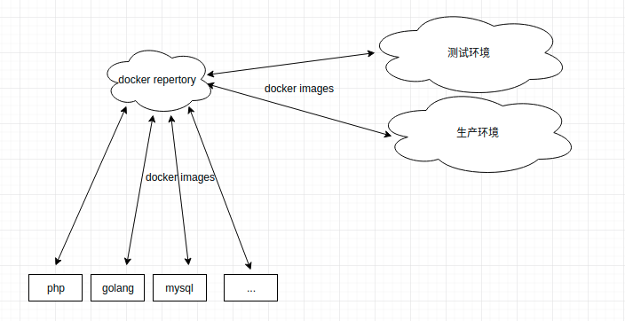

### 斗鱼tv服务器程序容器化


- **搭建方案** ：搭建私有仓库
- **系统平台** ：centos


#### 容器化部署流程



-------------------


#### 依赖
- **依赖软件**：
1. docker
2. docker-compose
- **依赖镜像**：
1. registry    # 功能:存储镜像
2. hyper/docker-registry-web # 功能:提供web网管, 方便管理镜像

#### Ubuntu 安装步骤
  [点击这里](https://blog.csdn.net/nimei31/article/details/80865601)

#### Windows 安装步骤
  [点击这里](http://www.runoob.com/docker/windows-docker-install.html)

### Centos 安装步骤
- **一 安装docker** ：
1. 安装docker (CentOS 系统的内核版本需要高于 3.10 ,centos7 以下版本不建议安装docker)

```
# 卸载旧的
$ sudo yum remove docker \
                  docker-common \
                  docker-selinux \
                  docker-engine
# 执行以下命令安装依赖包                  
$ yum install -y yum-utils device-mapper-persistent-data lvm2
# 使用国内源
$ sudo yum-config-manager \
    --add-repo \
    https://mirrors.aliyun.com/docker-ce/linux/centos/docker-ce.repo

# 开启使用模式
$ yum-config-manager --enable docker-ce-edge
$ yum-config-manager --enable docker-ce-test

# 开始安装docker-ce
$ yum makecache fast
$ yum install docker-ce
```
2. 启动docker deamon 
```
$ systemctl enable docker
$ systemctl start docker
```
- **二 安装docker-compose** ：
1. 安装python-pip
```
yum install python-pip
```
2. 无安装包
```
yum -y install epel-release
```
3. 升级python-pip
```
pip install --upgrade pip
```
4. 安装docker-compse
```
pip install docker-compose
```
5. 查看版本号
```
docker-compose -version
```


#### 使用步骤
- **一 拉取依赖docker image** ：
	1. 拉取仓库管理 registry
	```
	docker pull registry 
	```
	2.  拉取web管理 hyper/docker-registry-web
	```
	docker pull hyper/docker-registry-web
	```

- **二 docker 单实例启动 (在下面第五步提供了docker-compose启动方式)** ：
	1. 启动仓库 
	```
	# 创建一些挂载目录
	$ mkdir /data/registry # 创建docker存储镜像的挂载目录
	$ mkdir /data/certs # 存证书
	$ mkdir /data/auth # 存访问权限
	# 自签证书 (过程中e.g server FQDN or YOUR NAME 需要指定自己的域名，其他的无所谓)
	$ openssl req -newkey rsa:2048 -nodes -sha256 -keyout /data/certs/domain.key -x509 -days 1065 -out /data/certs/domain.crt 
	# 创建访问权限
	$ docker run --entrypoint htpasswd registry:2 -Bbn username password  > auth/htpasswd
	#  启动 registry (我这里暂时没有挂载auth目录，不影响使用)
	$ docker run -d -p 5000:5000 --restart=always --name registry    -v /data/registry:/var/lib/registry    -v /data/certs:/certs    -e REGISTRY_HTTP_TLS_CERTIFICATE=/certs/domain.crt    -e REGISTRY_HTTP_TLS_KEY=/certs/domain.key    registry:2  
	```
	2. 启动web管理(web 管理在局域网内有些问题，不建议使用)
	```
	$ docker run -d -p 8080:8080 --restart=always --name registry-web --link registry-srv -e REGISTRY_URL=https://docker.yb.com:5000/v2 -e REGISTRY_NAME=localhost:5000 hyper/docker-registry-web  # 启动web网管
	```

- **三 docker-compose 启动 **:
	1. cd 到docker-rep目录下 ’ls‘ 可以看到docker-compose.yml
	2. 执行如下命令来后台启动:
	```
	$ docker-compose up -d  # 启动 (第一次会自动拉取镜像)
	$ docker-compose down   # 停止
	```
- **四  使用方式 **:
注意: 客户端使用之前需要配置下证书，下面以linux平台为例
		```
			$ sudo mkdir /etc/docker/certs/docker.bj.dz11.com
			$ cp ./ca.crt /etc/docker/certs/docker.bj.dz11.com   # ca.crt 在此工程目录
			$ sudo service docker restart
		```
	1. 访问 [这个地址(web管理)](http://docker.yb.com:8080/)  可以查看公司镜像仓库都有哪些镜像 http://docker.yb.com:8080/
	2. 我们可以使用 'docker push/pull' 命令从仓库拉取镜像或者上传镜像
		# 举例:
	```
	# 构建镜像 (可以使用tag指定镜像名字，也可以直接指定仓库域名和端口到容器前面，类似于下面这样)
	$ sudo docker build -t docker.yb.com:5000/xxx.xxx.xxx:xxx 
	# 推送镜像 (重名会覆盖旧的)
	 $ sudo docker push  docker.yb.com:5000/test.server:latest
	 # 拉取镜像 
	 $ sudo docker pull  docker.yb.com:5000/test.server:latest
	```
	3. 我们除了使用web管理之外，仓库也提供rest api接口供我们调用
		# 举例
		```
		# 执行命令请求服务器api接口，会以json形式返回仓库数据(也可以直接在浏览器输入url)
		$ curl -k https://docker.yb.com:5000/v2/_catalog
		```
##说明
- 后期我会调研一款好用的web ui来显示仓库数据，也希望使用者提供更多的意见

## 反馈与建议
- 企业QQ：<zhaoxiaoyuan@douyu.tv>
- 邮箱：<zhaoxiaoyuan@douyu.tv>

---------


