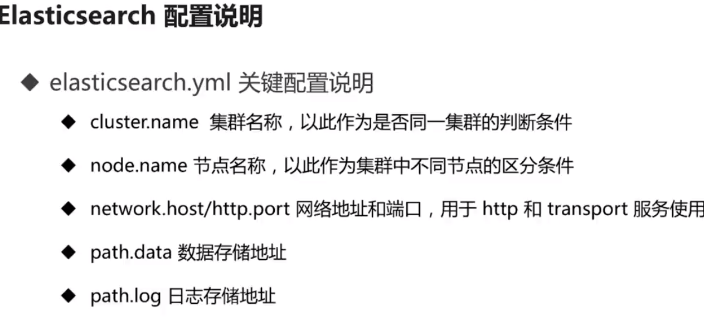

### 安装与运行
1. jdk1.8
2. elasticsearch下载
3. 运行 bin/elasticsearch

### ES配置 (所有配置都在 `xxx/elasticsearch/config`下)
1. elasticsearch.yml 

2. jvm.options (调整内存大小,根据系统情况配置)
3. log4j2.properties (日志级别设置)

### 运行后查看系统运行参数
1. http://127.0.0.1:9200/_cat/nodes?v 查看集群信息,有`*`的是主节点
2. http://127.0.0.1:9200/ 查看某服务配置
3. http://127.0.0.1:9200/_cluster/stats 查看集群具体情况

### kibana
下载运行

### kibana配置 (所有配置都在 `xxx/kibana/config`下)
1. kibana.yml