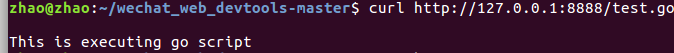

## golang cgi 案例

### 概述
1. cgi全名是通用网管接口
2. 很多编程语言都支持cgi
3. 主要功能是通过http协议，调用服务端的可执行文件，一般有php shell ，其他语言也是可以的，只要指定了可执行文件，就可以执行啦
4. cgi最开始我用c语言写过，还是比较简单的，http请求先发送到boa服务器(类似的支持cgi的很多)，boa调用cgi，cgi从标准输入流和环境变量读取数据里面读取，然后返回直接写到标准输出流里面，也就是stdio
5. cgi有一些标准的环境变量名称，用来指定一些参数，cgi进行可执行程序调用时候是使用exec族函数拉起一个进程执行的，所以参数是从进程env里面读取 (下图是没有指定可执行文件时候报的错误)

## 环境
1. 机器安装了go就行 我的是linux ，如果是其他系统请在`cgi_server.go`指定go root 

### 使用
1. 执行`cgi_server.go`假如成功会运行起来一个web server
2. 调用接口 `curl http://localhost:8888/test.go`

